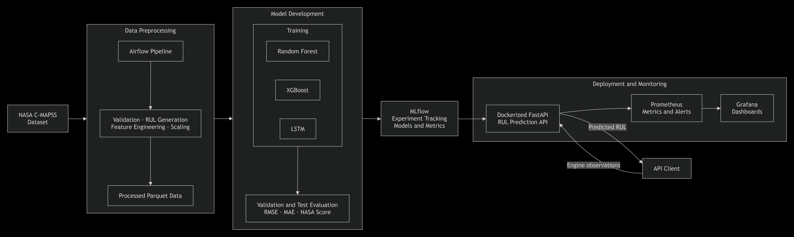

# Predictive Maintenance System for Turbofan Engines using Remaining Useful Life Estimation

Aircraft engines generate multivariate sensor measurements over repeated operating cycles. As degradation progresses, these measurements capture changes in engine condition that can be used to estimate how much useful operating life remains.

This system uses historical operating conditions and sensor trajectories to estimate the **Remaining Useful Life (RUL)** of a turbofan engine.

> **Given the observed operating history of an engine, predict the number of operational cycles remaining before failure.**

The system processes the available engine trajectory, applies the required preprocessing and model pipeline, and returns an estimated RUL for the latest observed cycle.

### Input

Each engine observation contains:

* Engine/unit ID
* Operating cycle
* 3 operating settings
* 21 sensor measurements

### Output

```text
Predicted Remaining Useful Life (RUL)
```

RUL represents the estimated number of operational cycles the engine can continue operating before failure.

---

## NASA C-MAPSS Dataset

The system is built using the **NASA C-MAPSS Turbofan Engine Degradation Dataset** from the NASA Ames Prognostics Center of Excellence (PCoE).

Dataset source: https://www.nasa.gov/intelligent-systems-division/discovery-and-systems-health/pcoe/pcoe-data-set-repository/

C-MAPSS contains simulated **run-to-failure multivariate time-series data** for turbofan engines. Each engine is observed across repeated operating cycles through operating settings and sensor measurements.

The dataset contains four subsets with different combinations of operating conditions and fault modes:

| Subset | Operating Conditions | Fault Modes |
| ------ | -------------------- | ----------- |
| FD001  | One                  | One         |
| FD002  | Multiple             | One         |
| FD003  | One                  | Multiple    |
| FD004  | Multiple             | Multiple    |

### Training Data

Training trajectories contain complete engine histories from the beginning of operation until failure. These trajectories provide the degradation history required to derive RUL targets for model training.

### Test Data

Test trajectories are truncated before failure. The objective is to estimate the number of cycles remaining after the final observed cycle.

### Dataset Directory

After downloading and extracting `CMAPSSData.zip`, place the original dataset files under:

```text
Data/CMAPSSData/
```

with data corresponding to:

```text
FD001
FD002
FD003
FD004
```


## Team Members

|       Name        | Roll Number     
| ----------------- | --------------- 
|    Aanchal Agarwal      | DA25M534
|    Tanya Suri     | DA25M628 


## System Architecture, Components and Folder structure 



| Component               | Technology / Location                              | Role                                                                                                                                           |
| ----------------------- | -------------------------------------------------- | ---------------------------------------------------------------------------------------------------------------------------------------------- |
| **Data**                | `Data/`, DVC                                       | Stores and versions raw C-MAPSS data and processed train/validation/test datasets.                                                             |
| **Data Processing**     | PySpark, `code/src/data_processing/`               | Validates trajectories, generates RUL targets, handles operating regimes, scaling, temporal features, and model-ready tabular/sequential data. |
| **Orchestration**       | Airflow, `code/src/dags/`                          | Orchestrates preprocessing for FD001–FD004 and records the resulting MLflow preprocessing runs.                                                |
| **Model Training**      | Random Forest, XGBoost, LSTM, `code/src/training/` | Trains tree-based and sequence models using processed engine trajectories.                                                                     |
| **Evaluation**          | `code/src/training/evaluation/`                    | Evaluates models using RMSE, MAE, NASA asymmetric score, prediction bias, and engine-level diagnostics.                                        |
| **Experiment Tracking** | MLflow, `code/src/tracking/`                       | Tracks preprocessing and training runs, parameters, metrics, artifacts, preprocessing state, and trained models.                               |
| **Inference**           | `code/src/inference/`                              | Loads the selected model and preprocessing state, transforms incoming trajectories consistently, and predicts RUL.                             |
| **Serving**             | FastAPI, Docker, `code/api/`                       | Exposes `/health`, `/predict`, and `/metrics` endpoints for model serving.                                                                     |
| **Monitoring**          | Prometheus, Grafana, `monitoring/`                 | Tracks prediction requests, errors, latency, RUL outputs, and configured service alerts.                                                       |


### System Flow

```text
nasa_c_mapss/
├── Data/
│   ├── CMAPSSData/                    # Raw NASA C-MAPSS datasets
│   ├── CMAPSSData.dvc                 # Raw-data DVC tracking
│   ├── processed/                     # Processed Parquet datasets
│   └── processed.dvc                  # Processed-data DVC tracking
│
├── code/
│   ├── api/
│   │   ├── app.py                     # FastAPI application and endpoints
│   │   └── api_schemas.py             # Request and response schemas
│   │
│   ├── src/
│   │   ├── dags/
│   │   │   ├── airflow_config.py      # Airflow runtime configuration
│   │   │   └── cmapss_preprocessing.py
│   │   │
│   │   ├── data_processing/
│   │   │   ├── data_loader.py
│   │   │   ├── schema.py
│   │   │   ├── validation.py
│   │   │   ├── preprocessing.py
│   │   │   ├── feature_engineering.py
│   │   │   ├── scaling.py
│   │   │   ├── scaler_state.py
│   │   │   ├── split.py
│   │   │   ├── tabular.py
│   │   │   ├── sequences.py
│   │   │   ├── artifacts.py
│   │   │   └── constants.py
│   │   │
│   │   ├── training/
│   │   │   ├── tree_models/
│   │   │   │   ├── run_tabular_training.py
│   │   │   │   ├── train_random_forest.py
│   │   │   │   ├── train_xgboost.py
│   │   │   │   └── tabular.py
│   │   │   │
│   │   │   ├── lstm/
│   │   │   │   ├── run_lstm.py
│   │   │   │   └── train_lstm.py
│   │   │   │
│   │   │   └── evaluation/
│   │   │       ├── model_evaluation_metrics.py
│   │   │       ├── test_evaluation.py
│   │   │       └── engine_endpoint_evaluation.py
│   │   │
│   │   ├── tracking/
│   │   │   ├── mlflow_tracking.py
│   │   │   ├── mlflow_run_id.py
│   │   │   └── spark_mlflow_tracking.py
│   │   │
│   │   ├── inference/
│   │   │   ├── predict.py
│   │   │   └── inference_monitoring.py
│   │   │
│   │   └── build_spark.py
│   │
│   └── tests/                          # Automated test suite
│
├── monitoring/
│   ├── prometheus.yml
│   ├── prometheus-rules/
│   │   └── alerts.yml
│   └── grafana/
│       ├── dashboards/
│       └── provisioning/
│
├── mlruns/                             # Local MLflow tracking data
├── Dockerfile.serve                    # FastAPI container image
├── docker-compose.yml                  # Prometheus and Grafana services
├── pyproject.toml                      # Dependencies and project settings
└── readme.md
```

## Project Setup Instructions

### Prerequisites

* Linux or WSL2
* Python 3.12
* Java 17+
* `uv`
* Docker + Docker Compose

### Install

```bash
git clone https://github.com/AanchalA/NASA-CMAPSS-TurboEngine-RUL.git
cd NASA-CMAPSS-TurboEngine-RUL

uv sync --frozen --extra offline --extra train --extra serve
source .venv/bin/activate

export PYTHONPATH="$PWD/code"
export MLFLOW_TRACKING_URI="file://$PWD/mlruns"
```

In each new terminal:

```bash
source .venv/bin/activate
export PYTHONPATH="$PWD/code"
export MLFLOW_TRACKING_URI="file://$PWD/mlruns"
```

### Add Dataset

Extract `CMAPSSData.zip` into:

```text
Data/CMAPSSData/
```

The directory should contain the `train`, `test`, and `RUL` files for `FD001`–`FD004`.

---

## Run Preprocessing

Configure Airflow once:

```bash
export AIRFLOW_HOME="$PWD/.airflow"
export AIRFLOW__CORE__DAGS_FOLDER="$PWD/code/src/dags"

airflow db migrate
airflow pools set spark_preprocessing 1 "Serializes local Spark preprocessing jobs"
```

Start Airflow:

```bash
airflow standalone
```

In another terminal:

```bash
source .venv/bin/activate

export PYTHONPATH="$PWD/code"
export MLFLOW_TRACKING_URI="file://$PWD/mlruns"
export AIRFLOW_HOME="$PWD/.airflow"
export AIRFLOW__CORE__DAGS_FOLDER="$PWD/code/src/dags"

airflow dags unpause cmapss_preprocessing
airflow dags trigger --conf '{"subset":"ALL"}' cmapss_preprocessing
```

Use `FD001`, `FD002`, `FD003`, or `FD004` instead of `ALL` to process one subset.

Processed data is written to:

```text
Data/processed/<subset>/<preprocessing-run-id>/
```

---

## Run Model Training

### Random Forest

```bash
python code/src/training/tree_models/run_tabular_training.py \
  --model-type random_forest \
  --subset-id FD001
```

### XGBoost

```bash
python code/src/training/tree_models/run_tabular_training.py \
  --model-type xgboost \
  --subset-id FD001
```

### LSTM

```bash
python code/src/training/lstm/run_lstm.py \
  --subset-id FD001
```

Replace `FD001` with the required subset. Models, metrics, and artifacts are recorded in MLflow.

---

## Run MLflow

```bash
export MLFLOW_TRACKING_URI="file://$PWD/mlruns"
MLFLOW_ALLOW_FILE_STORE=true mlflow ui \
  --backend-store-uri "$MLFLOW_TRACKING_URI" \
  --host 0.0.0.0 \
  --port 5000
```

Open `http://localhost:5000` to view preprocessing and training runs.

---

## Run Model Serving

### Local

```bash
uvicorn api.app:app \
  --app-dir code \
  --host 0.0.0.0 \
  --port 8000
```

### Docker

```bash
docker build -f Dockerfile.serve -t nasa-cmapss-api .

docker run --rm \
  -p 8000:8000 \
  -e MLFLOW_TRACKING_URI="file://$PWD/mlruns" \
  -v "$PWD/mlruns:$PWD/mlruns:ro" \
  nasa-cmapss-api
```

The serving container only requires the trained MLflow artifacts.

---

## API Endpoints

### Health Check

```bash
curl http://localhost:8000/health
```

Expected:

```json
{"status":"ok"}
```

### Predict RUL

```bash
curl -X POST http://localhost:8000/predict \
  -H "Content-Type: application/json" \
  -d '{
    "subset_id": "FD004",
    "model_type": "RandomForestRegressor",
    "observations": [
      {
        "unit_id": 1,
        "cycle": 1,
        "setting_1": 0.0,
        "setting_2": 0.0,
        "setting_3": 100.0,
        "sensor_1": 0.0,
        "sensor_2": 0.0,
        "sensor_3": 0.0,
        "sensor_4": 0.0,
        "sensor_5": 0.0,
        "sensor_6": 0.0,
        "sensor_7": 0.0,
        "sensor_8": 0.0,
        "sensor_9": 0.0,
        "sensor_10": 0.0,
        "sensor_11": 0.0,
        "sensor_12": 0.0,
        "sensor_13": 0.0,
        "sensor_14": 0.0,
        "sensor_15": 0.0,
        "sensor_16": 0.0,
        "sensor_17": 0.0,
        "sensor_18": 0.0,
        "sensor_19": 0.0,
        "sensor_20": 0.0,
        "sensor_21": 0.0
      }
    ]
  }'
```

For XGBoost, use:

```json
"model_type": "XGBRegressor"
```

For LSTM, use:

```json
"model_type": "LSTMRegressor"
```

For LSTM predictions, supply multiple observations from the same engine when
available. The API orders them by cycle and uses the latest sequence window.

Supported model identifiers:

| Training model  | API `model_type`        |
| --------------- | ----------------------- |
| `random_forest` | `RandomForestRegressor` |
| `xgboost`       | `XGBRegressor`          |
| `lstm`          | `LSTMRegressor`         |

Example response:

```json
{
  "subset_id": "FD004",
  "model_type": "RandomForestRegressor",
  "predicted_rul": 87.42
}
```

Use real engine observations for meaningful predictions. For Random Forest and
XGBoost, prediction uses the latest processed observation. For LSTM, prediction
uses the latest sequence of processed observations.

### Metrics

```bash
curl http://localhost:8000/metrics
```

Interactive API documentation:

```text
http://localhost:8000/docs
```

---

## Run Monitoring

With the API running:

```bash
docker compose up -d
```

| Service    | Address                 |
| ---------- | ----------------------- |
| FastAPI    | `http://localhost:8000` |
| Prometheus | `http://localhost:9090` |
| Grafana    | `http://localhost:3000` |

Grafana default credentials:

```text
admin / admin
```

Stop monitoring:

```bash
docker compose down
```
